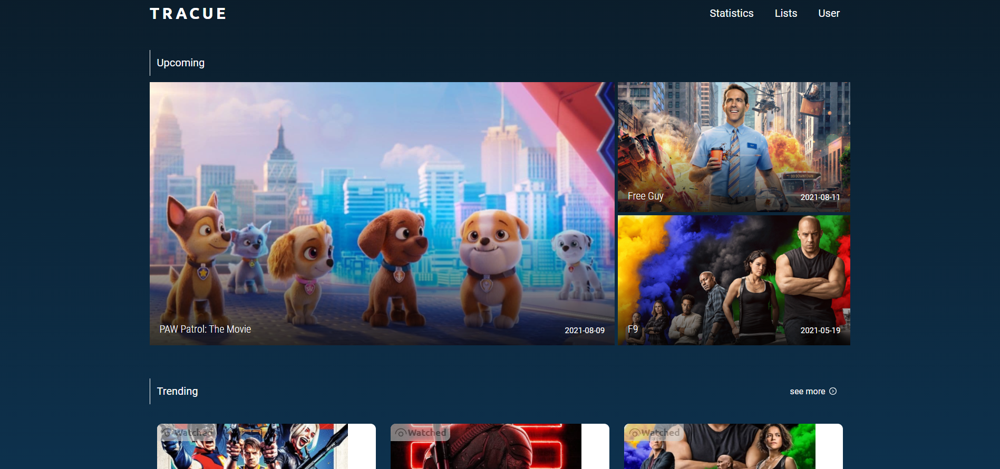

# Tracue Frontend

Tracue is an open-source, movie tracking website.



## Local Setup

Clone the project's repo and install the dependencies.

```bash
git clone https://github.com/tracue/frontend
```

```bash
yarn install
```

```bash
yarn start
```

## License

[MIT](LICENSE.md)
